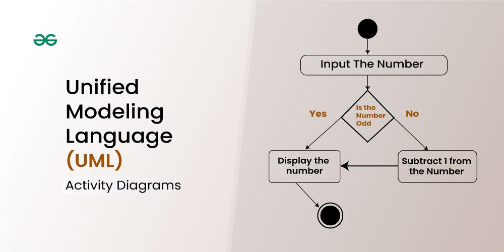
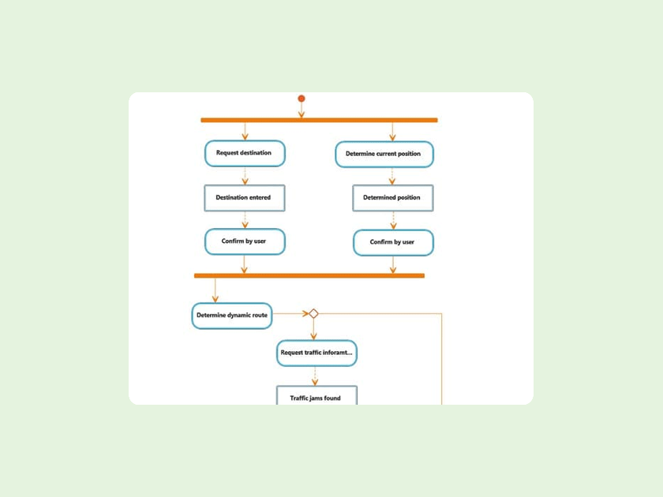
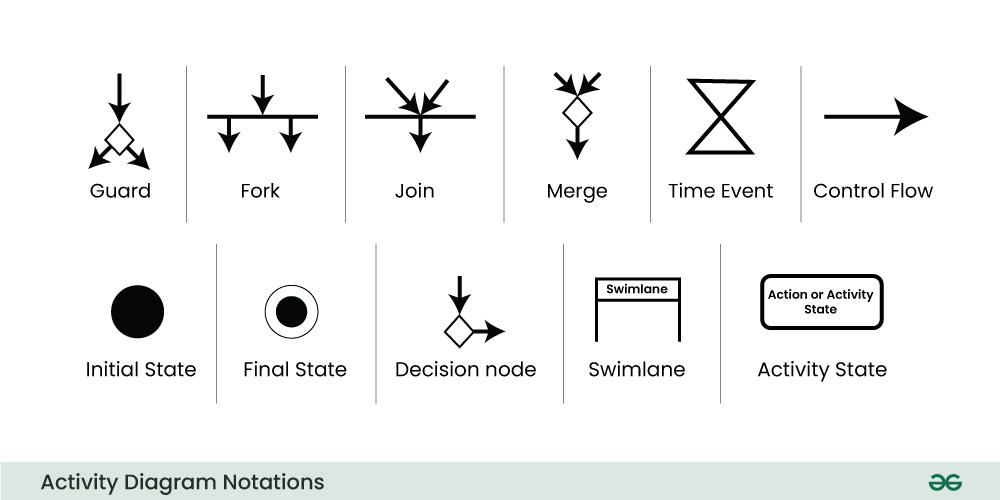

1. Introduction to Activity Diagrams

Definition: activity diagram is visual representation of system's actions or flow control.

Purpose:

Activity diagrams can describe steps in a use case diagram, illustrate a business process, simplify complicated use cases

To represent workflows, both simple and complex.
To show control flow and data flow within the system.
When to Use Them: Understanding when an activity diagram is the right tool, e.g., for system analysis or process modeling.

example for activity diagram 
* input a number and check condition true or false

activity diagram notations

2.
Key Components of Activity Diagrams
Activity: Represents a single step or task in the workflow.
Initial Node: Shows where the activity begins.
Final Node: Represents where the activity ends.
Action: A task performed in the workflow.
Control Flow: Arrows connecting actions, indicating the sequence of execution.
Decision Node: A branching point with multiple outgoing edges based on conditions.
Merge Node: Combines multiple paths back into a single flow.
Fork Node: Splits the flow into parallel paths.
Join Node: Merges parallel flows back into one path.
Swimlanes: Divide the diagram to show responsibilities across different entities or roles.

3.
 Creating an Activity Diagram
Defining the Purpose: Understand what the diagram is meant to illustrate.
Identifying Activities: List all actions or tasks in the workflow.
Defining Flow and Transitions: Show the order and dependencies between activities.
Using Tools: Learn to use UML tools like Lucidchart, Microsoft Visio, or any drawing software.

4.
 Notations and Syntax
Standard Symbols: Familiarize yourself with UML's notations like ovals, diamonds, and bars.
Annotations: Learn how to label actions and decisions for clarity.
Guard Conditions: Logical expressions placed on arrows from a decision node.

5.
 Practical Scenarios
Business Processes: Model workflows in business applications like sales or recruitment.
System Workflows: Illustrate control flow for system-level operations like authentication.
Real-World Examples: Study existing diagrams to understand best practices.

6.
 Advanced Features
Object Flow: Show data flow between activities, not just control flow.
Interruptions: Model events that interrupt normal activity flow.
Loops: Represent repeating activities using loops in the diagram.

7.
 Common Mistakes and How to Avoid Them
Creating overly complex diagrams.
Not labeling decisions or conditions.
Missing relationships between activities.
Mixing unrelated processes in one diagram.

8.
 Practical Exercises

Draw an activity diagram for:
A login process in a system.
A customer ordering food online.
A library borrowing system.

