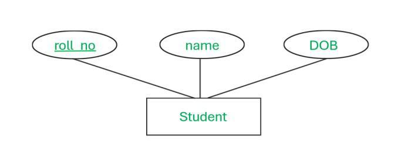

1. 
definition - er diagram stands for entity relationship diagram. it is represent how to relate entities of database with each other.it is used to plan database structure.

purpose - determine requirements , understand data , help to design database

2. 
entities -  objects or concepts
entity can store information about er diagram. entities are usually represented as a rectangle in er diagram.
example for the entities = students , employees , customers , items

types - there are two types in entities such as strong entity and weak entity

strong etity - it is not depend on another entity. strong entity always have a primary key.
strong entities are represented by single rectangle.
The relationship of two strong entities is represented by a single diamond

weak entity - it is depend on strong entity. it does not have a primary key.
weak entities are represented by double reactangles.
The relation between one strong and one weak entity is represented by a double diamond.

attributes - properties or relationships
examples for attributes = name , address , email , item_code

purpose - attributes help define and organize data

types - there are 5 types of attributes such as simple, composite , derived , multivalued , key sttributes
Simple vs. Composite Attributes (e.g., FullName vs. FirstName and LastName).
Single-valued vs. Multi-valued Attributes (e.g., roll number vs Phone Numbers).
Derived Attributes (e.g., Age derived from DOB).

simple attributes

composite attributes

single-valued attributes

multi-valued attributes

derived attributes

key attributes
Key attributes are those attributes that can uniquely identify the entity in the entity set.
Example: Roll-No is the key attribute because it can uniquely identify the student. 

keys - 
Different Types of Database Keys
Candidate Key
Primary Key
Super Key
Alternate Key
Foreign Key
Composite Key

primary key - primary key is a column or set of columns of rdbms table that can uniquely identify each record(row).
primary key is unique.
it can not be null
it has no duplicate values. it has unique values.
it can identify as one record at a time

candidate key -  candidate key is a set of columns that uniquely identifies each record
it can contain null values.
it must contain unique values.
There can be more than one candidate key in a relationship.
A table can have multiple candidate keys but only one primary key.

foreign key -
It is a key it acts as a primary key in one table and it acts as
secondary key in another table.
It combines two or more relations (tables) at a time.

composite key -
It acts as a primary key if there is no primary key in a table
Two or more attributes are used together to make a composite key .
Different combinations of attributes may give different accuracy in terms of identifying the rows uniquely.

relationships- 
Definition: How entities are related (e.g., "Student enrolls in Course").
Types of relationships: One-to-One (1:1), One-to-Many (1:N),Many-to-One (N:1), Many-to-Many (M:N).

3.
Rectangles: Represent entities, which are objects or concepts that store information

Ellipses: Represent attributes, which are characteristics of an entity

Diamonds: Represent relationships, which show how entities share information

Lines: Connect attributes to entities and entity types with other relationship types

Primary key: Underlines the attributes to establish unique identification

Double ellipses: Represent multi-valued attributes, which can have more than one value

Double rectangles: Represent weak entities, which are entities that must be defined by a foreign key relationship with another entity

Vertical segments: Denote mandatory entities

Open circles: Denote optional entities

Crow's feet: Represent a 1:n relationship

Rings: Represent "zero"

Dashes: Represent "one"

4.
Relationship Constraints -

Cardinality: Maximum number of instances involved (1:1, 1:N, M:N).
Participation: Total or Partial participation (e.g., Mandatory or Optional relationship)

total participation - means every entity in a set must participate in a relationship.
partial participation - means only some entities from a set need to participate in a relationship

total participation is mandatory while partial participation is optional

 usually indicated by a double line for total and a single line for partial on an ERD.

5.
Specialization and Generalization

Specialization: Subtypes of entities (e.g., Employee can be Manager or Clerk).
Specialization is also called as ” Top-Down approch”.
the higher-level entity is specialized into two or more lower-level entities.

Generalization: Combining entities into a general parent entity.
 It is a bottom-up approach
 two or more entities can be generalized to a higher-level entity if they have some attributes in common. 

6.
 Weak Entities
Definition: Entities that depend on a strong entity (e.g., Dependent depends on Employee).
Identifying Relationships: Linking a weak entity to its strong entity using primary and foreign keys.

7.
 Aggregation and Composition
Aggregation: Abstracting a relationship as an entity for higher-level relations.
Aggregation is an abstraction through which we can represent relationships as higher-level entity sets.

Composition: Combining entities or attributes into a composite whole.

8.
 ERD to Database Schema
Mapping ER Diagram elements to tables, keys, and relationships.
Handling M:N relationships using associative tables.

9.
 Tools and Software for ER Diagrams
Online Tools: Lucidchart, draw.io, sqlDBM, dbdiagram.io.
Software: MySQL Workbench, Microsoft Visio, ER/Studio, Oracle SQL Developer.

10.
 Case Studies and Practice
Real-world example scenarios:
University database: Entities like Student, Course, Instructor.
E-commerce database: Entities like Customer, Order, Product.
Hands-on exercises in designing ERDs for specific applications.
