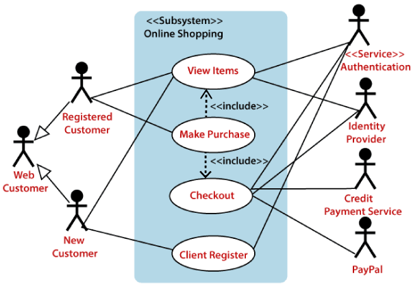

1. use case 
A use case diagram is used to represent the dynamic behavior of a system. It encapsulates the system's functionality by incorporating use cases, actors, and their relationships.

purpose of the use case diagram :
generate test cases
validate a system architecture
capture the requirements of the system

2. Use Case Components
Actors: Entities (human or system) that interact with the system.
Goals: Objectives that the actor wants to achieve using the system.
System: The software or process that facilitates the actor’s goal.

3. Use Case Elements
Basic Flow (Happy Path): The standard flow where everything works as intended.
Alternate Flows: Non-standard paths or variations in interaction.
Exception Flows: Situations where something goes wrong (errors, edge cases).
Preconditions: Conditions that must be true for the use case to start.
Postconditions: Conditions that must be true once the use case is complete.

4. Use Case Notations
UML Use Case Diagrams: Graphical representation of actors and use cases.
Use Case Description: Textual description detailing the scenario step-by-step.

